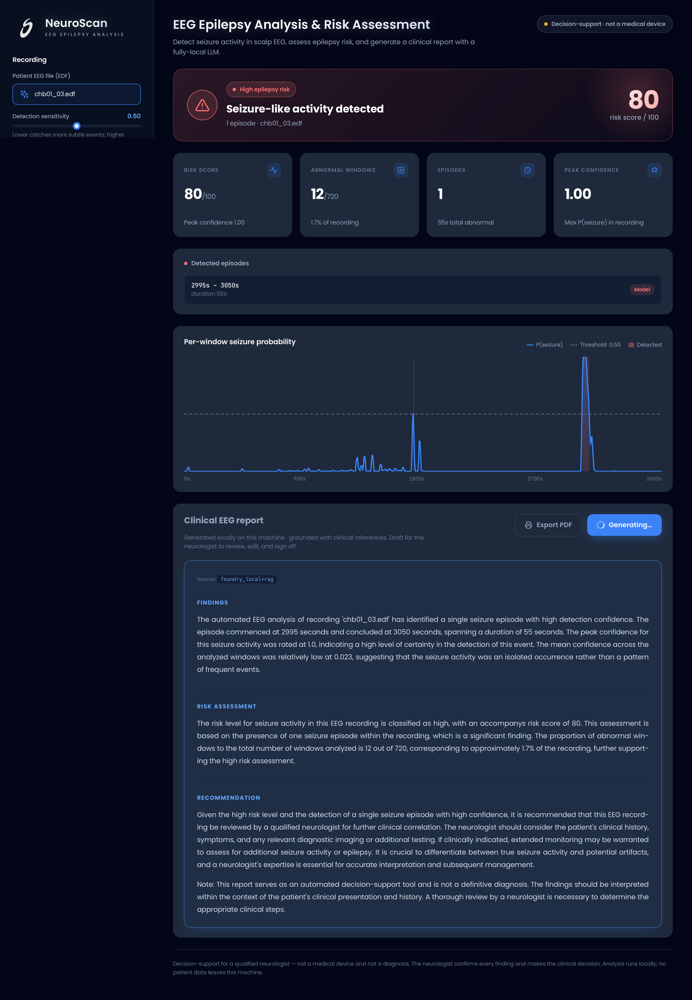

# NeuroScan — AI-Powered EEG Analysis & Epilepsy Risk Assessment

## Project Video

Watch the project video [here](https://drive.google.com/file/d/1HfcdeVhxI6KtM6jSEWdZPCVmv_zjM3WJ/view?usp=sharing).

An end-to-end, **offline-capable** clinical-support tool that reads a scalp EEG (EDF),
detects seizure-like activity with a 1D CNN, produces a **recording-level epilepsy risk
score**, and generates an **expert-style clinical report** with a **local LLM** (Azure AI
Foundry Local), optionally grounded by a **local RAG** knowledge base.

Built on the [CHB-MIT Scalp EEG Database](https://physionet.org/content/chbmit/).
**Decision-support for a neurologist — not a medical device, and not a diagnosis.**

```
EEG (EDF) ─▶ window ─▶ 1D CNN ─▶ per-window seizure probability
                                        │
                                        ▼
                          episode post-processing ─▶ risk score (0–100 + level)
                                        │
                          RAG (local docs) ─┐      │
                                            ▼      ▼
                             local LLM (Foundry Local) ─▶ clinical report
```

With the local provider, **no patient data leaves the machine**.



---

## The product: a focused clinical web tool

The web UI (`serve_ui.py`, `http://localhost:8000`) is built for **one user: the
neurologist**. Every control is a clinical decision; all infrastructure choices are
fixed to safe defaults and hidden.

- **Upload → Analyze → Report.** Upload the patient's EDF, optionally adjust detection
  sensitivity, and analyze. One click generates an editable clinical report.
- **What you see** — a colour-coded epilepsy-risk score (0–100), summary metrics, the
  detected seizure episodes with timing, a per-window seizure-probability timeline (hover
  for the value at any second; the sensitivity slider re-thresholds the chart live), and
  a structured report with **Export PDF**.
- **Privacy by default** — the CNN and the report LLM run locally; nothing is sent
  off-device. The report's numbers come from the model, not the LLM — the LLM only
  narrates them, so it can't invent a figure.
- **Decision-support, not a diagnosis** — the tool does the slow first pass; the
  neurologist confirms every finding and makes the call.

A Streamlit app (`streamlit run app.py`) is kept as a parallel developer/experiment
frontend over the identical pipeline.

---

## How it works

**1. Signal → windows.** The EDF is read with MNE, split into 5-second windows (256 Hz →
1280 samples), reduced to the model's 23-channel montage, and normalized with the stats
stored in the checkpoint (so preprocessing is reproduced exactly at inference).

**2. Detection (1D CNN, PyTorch).** `SeizureCNN2` scores each window's seizure
probability. It is regularized for cross-patient generalization: BatchNorm after each
conv, global average pooling instead of a large fully-connected head, and dropout.
Inference uses **50% overlapping windows** (averaged back onto the base grid) so seizures
that straddle a window boundary aren't missed. Probabilities are optionally
**temperature-calibrated** (`models/calibration.json`, fit by `scripts/calibrate.py`).

**3. Risk assessment (rule-based, explainable).** Per-window probabilities are smoothed,
consecutive detections are merged across brief sub-threshold dips, and episodes shorter
than a minimum duration are dropped — so a fragmented seizure reads as one clinical
event. The 0–100 score is a transparent blend of peak confidence, episode count, and
burden (`src/risk_assessment.py`). No LLM is involved here — the numbers are auditable.

**4. Report (RAG + local LLM).** A query built from the structured findings retrieves the
most relevant passages from `data/knowledge/` (TF-IDF + cosine similarity, fully offline),
which ground a report written by a local model (Microsoft Phi-3.5 via Foundry Local) in
three sections: Findings, Risk Assessment, Recommendation.

---

## Results

**Single-subject (chb01), held-out window split** — optimistic (patient seen in training):

| Metric | Value |
|--------|-------|
| F1 | ~0.88–0.94 |
| Recall | ~79–90% |
| Precision | 100% |

**Cross-subject (leave-one-subject-out over 7 patients: chb01,02,03,05,06,07,08)** —
the honest test, each patient held out entirely during training:

| Config | F1 (pooled) | Recall | mean-fold F1 |
|--------|-------------|--------|--------------|
| `SeizureCNN` (baseline) | 0.388 | 0.57 | 0.373 |
| `SeizureCNN2` (BatchNorm + global pool + dropout) | **0.399** | **0.63** | **0.440** |

> **Findings:** (1) the **regularized architecture generalizes better**; (2) **more
> patients did not raise the headline F1** — cross-subject seizure detection is genuinely
> hard; (3) the dominant effect is **per-patient variance** (the same model scores
> F1 ~0.81 on chb01 but ~0.02 on chb06), which is exactly why real clinical systems use
> **patient-adaptive calibration**. A 2×2 ablation also showed per-*window* channel
> z-scoring **hurts** — a tested negative result, not an assumption.

---

## Project layout

```
eeg-epilepsy-project/
├── serve_ui.py                 # clinical web UI server (stdlib only) → localhost:8000
├── app.py                      # Streamlit frontend (parallel, same pipeline)
├── design/                     # frontend (HTML/CSS/JS) + logo + screenshot
│   ├── app.html · app.js · neuroscan.css
│   ├── epilogo.png · FigmaDesign.png
├── data/
│   ├── raw/chbNN/              # EDF recordings + summaries (not in git — download)
│   └── knowledge/              # local RAG corpus (EEG/epilepsy reference docs)
├── models/                     # checkpoints + calibration.json (not in git)
├── scripts/
│   ├── download_foundry_model.py   # download + warm up a local LLM
│   └── calibrate.py                # fit temperature scaling for the CNN
├── src/
│   ├── parse_summary.py · windowing.py · build_dataset.py · cross_subject.py
│   ├── model.py                # SeizureCNN + SeizureCNN2 (regularized)
│   ├── train.py · train_cross_subject.py · train_final.py
│   ├── predict.py              # inference (overlap + calibration)
│   ├── risk_assessment.py      # per-window probs → risk (smooth/merge/score)
│   ├── clinical_report.py      # report entry point (provider + RAG orchestration)
│   ├── llm/                    # swappable LLM providers (foundry_local / anthropic / template)
│   └── rag/                    # local retrieval (TF-IDF documents/index/retriever)
├── tests/                      # unit tests (risk assessment)
├── .github/workflows/ci.yml    # CI: run tests on push/PR
├── requirements.txt · README.md
```

---

## Setup

```bash
python3 -m venv venv
source venv/bin/activate
pip install -r requirements.txt
```

### Data
The raw EEG is **not** committed (large files). Download subjects from the
[CHB-MIT database](https://physionet.org/content/chbmit/) into `data/raw/chbNN/`, each
with its `chbNN-summary.txt` and the relevant `*.edf` files.

---

## Usage

### Run the clinical web app (live CNN + local LLM)
```bash
python serve_ui.py        # → http://localhost:8000  (no extra dependencies)
```
Upload a patient EDF, adjust detection sensitivity if needed, **Analyze**, then
**Generate report**. The CNN analysis works with PyTorch alone; to get a local-LLM
report, install Foundry Local and download a model once (see below).

### Train / evaluate the models
```bash
python -m src.train                 # single-patient model → models/seizure_cnn.pt
python -m src.train_cross_subject    # leave-one-subject-out CV (honest generalization)
python -m src.train_final            # deployable SeizureCNN2 → models/seizure_cnn2_final.pt
```
Checkpoints bundle the weights, channel montage, and normalization stats, so inference
reproduces the exact preprocessing.

### Calibrate confidences (optional)
```bash
python -m scripts.calibrate chb01 chb02 chb03   # → models/calibration.json
```
Fits temperature scaling so reported probabilities better reflect true frequencies;
`src.predict` picks the file up automatically.

### Tests
```bash
pytest tests/            # risk-assessment unit tests (numpy only — fast)
```

---

## Local LLM (Azure AI Foundry Local)

The report layer is **local-first**. `foundry-local-sdk` is self-contained on macOS —
download a model once, then it runs fully offline:

```bash
python scripts/download_foundry_model.py qwen2.5-0.5b   # small, fast first test
python scripts/download_foundry_model.py phi-3.5-mini   # better report quality
```

### Providers (swappable via `REPORT_LLM_PROVIDER`)
| Provider | What runs | Notes |
|----------|-----------|-------|
| `foundry_local` (default) | local model (Phi-3.5-mini, …) | fully offline; no data leaves the machine |
| `anthropic` | cloud model | **opt-in, off by default** — sends data off-device |
| `template` | deterministic, no LLM | always-available offline fallback |

Swap the local model with one value (`REPORT_LLM_MODEL=phi-4`). The provider and the RAG
retriever both sit behind small interfaces, so either can be replaced without touching
callers.

### RAG (local knowledge base)
Drop epilepsy/EEG reference docs (guidelines, interpretation rules, sample reports) into
`data/knowledge/`. With RAG enabled, the report is grounded in the most relevant passages.
The default retriever is TF-IDF (scikit-learn, zero extra infra); a semantic
`EmbeddingRetriever` can be added behind the same interface.

---

## Known limitations / next steps
- **Cross-subject accuracy is modest (~0.4 F1)** and highly patient-dependent — the real
  lever is **patient-adaptive calibration** (fine-tune on a small slice of the target
  patient) and/or many more subjects.
- **No fixed training seed**, so results vary run to run.
- **Not a medical device** — research/educational only. All outputs are decision-support
  for a qualified neurologist, not a diagnosis.